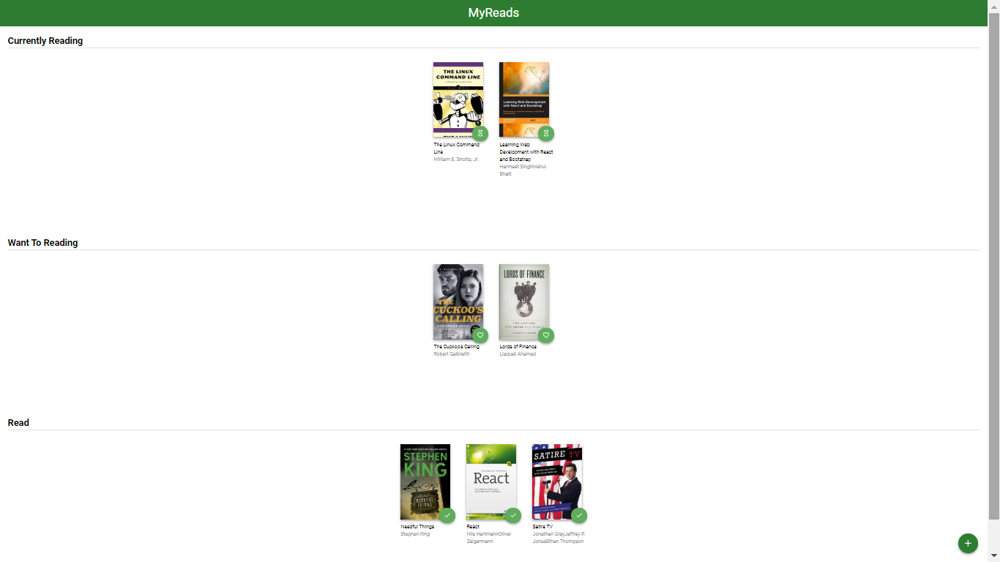
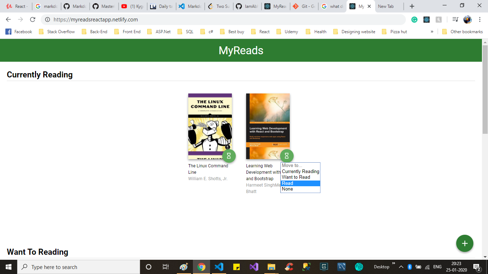
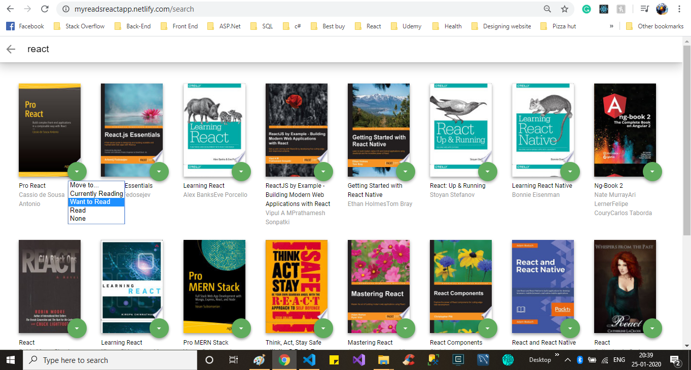

# MyReads Project

### working demo of this project is available [here](https://myreadsreactapp.netlify.com/). this project is final project of Udacity's **Front end neno degree** course.

## Functionality

- This website able to track your books's current status. Each book has 3 available status.

  1. Currently Reading
  2. Want to read
  3. Read

- User can change the status any time when they are done reading with book. User just need to click the green **icon** which is located in **Bottam Right Corner** of the book image, as shown in below image.

- User also can browse the book from database by using API calls. User need to click at the **+** icon at bottom right of the web site. It navigates the use to search page.

- User can search the book and directly add the books to one of the three catatgories of book shelves. By just selecting the option from the drop down as show in image above.

### This application gives multipage web site feeling in single page application by using react router.

### Thanks for stopping by and reviewing my work.
